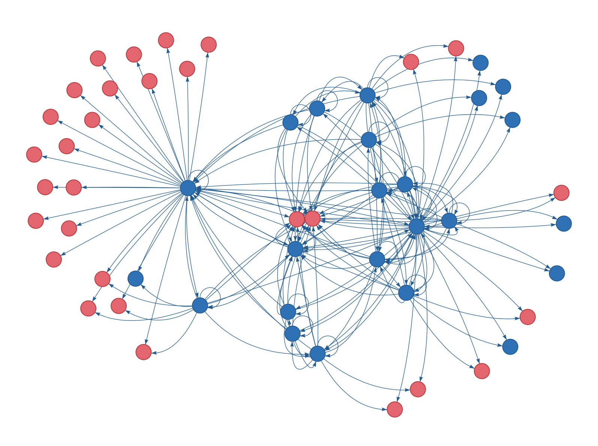

# Website link graph visualization



- [my blog post about this project](https://www.cs.cornell.edu/~kt/post/site-graph/)
- [a live example on my website](https://www.cs.cornell.edu/~kt/graph/)

## Dependencies
python3
- bs4
- pyvis
- networkx
- requests
- scipy

## Running

```
git clone https://github.com/tomlinsonk/site-graph.git
cd site-graph
pip3 install -r requirements.txt
python3 site_graph.py https://www.cs.cornell.edu/~kt/
```

To see site of interest for you, just change the URL.

To see more options, run:
```python3 site_graph.py -h```

Blue nodes are internal pages, green nodes are internal resource files (anything that isn't HTML), red nodes are external pages, and yellow nodes are pages with errors. Hover over nodes to see URLs and specific errors (e.g. 404, 500, timeout).  


## Contributing
This code is under a MIT License. Feel free to make pull requests if there are some features you'd like included (or bugs you'd like fixed).
