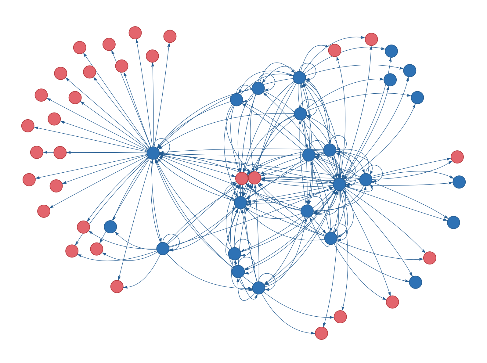

# Website link graph visualization



- [my blog post about this project](https://www.kirantomlinson.com/post/site-graph/)
- [a live example on my website](https://www.kirantomlinson.com/graph/)

## Dependencies
python3
- bs4
- pyvis
- requests

## Setup

```
git clone https://github.com/tomlinsonk/site-graph.git
cd site-graph
python3 -m venv venv
source venv/bin/activate
pip3 install -r requirements.txt
```

## Running

```
python3 site_graph.py https://www.kirantomlinson.com/
```
Replace the URL with the site you want to graph. This saves the visualization to `site.html` and the crawl data to `crawl.json`.
Use `--vis-file` and `--json-file` to change the filenames.

Blue nodes are internal pages, green nodes are internal resource files, orange nodes are external links, and red nodes have errors. Hover over a node to see its URL and any errors.

Add `--visit-external` to check external links. `--workers N` sets the number of parallel external checks (default: 4).
Use `--only-404` to color only 404 errors red. Other errors are still shown on hover.

Add `--interactive-controls` to search URLs, filter nodes, and highlight links to and from a selected node.
Error filters also show the pages linking to those errors and the internal paths leading to them.

Use `--show-buttons` to adjust the drawing settings in the browser. You can save the generated options to a file and load it with `--options`.
Run `python3 site_graph.py -h` for all options.

### Saved crawls

To redraw a saved crawl without fetching the site again:
```
python3 site_graph.py --from-data-file crawl.json
```

The input file is left unchanged.
See [CRAWL_JSON.md](CRAWL_JSON.md) for the data format.

### Local files

Serve the files with `python3 -m http.server 8080 --directory PATH`, then run:
```
python3 site_graph.py http://localhost:8080/
```

## Files
- `site_graph.py`: command-line interface
- `crawler.py`: fetches pages and follows links
- `crawl_result.py`: crawl data, JSON loading/saving, and summaries
- `render.py`: creates the HTML graph using `graph_layout.html` and `interactive_controls.html`

## Contributing
Run `python3 -m unittest` to run the tests. Browser tests use Chrome or Chromium.
This code is under a MIT License. Feel free to make pull requests if there are some features you'd like included (or bugs you'd like fixed).
